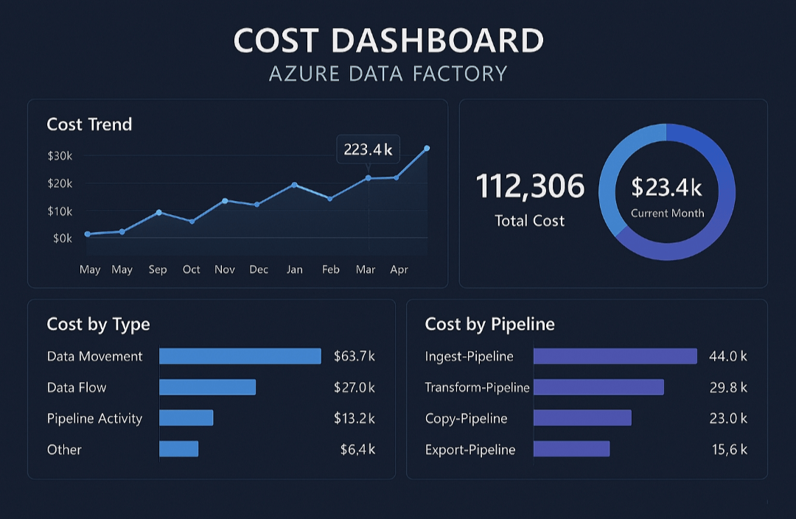

## Monitoramento de Custos no Azure Data Factory 


**Bootcamp Microsoft AI for Tech - Azure Databricks.**


---

## Visão Geral

Este projeto demonstra como criar um monitoramento de custos no Azure Data Factory, utilizando boas práticas de automação, alertas, dashboards e infraestrutura como código (ARM Templates).

Ele é voltado para estudantes e profissionais que desejam controlar e otimizar gastos em ambientes de nuvem, aplicando práticas reais de gestão de recursos no Azure.


---

## Objetivo do Projeto

O objetivo deste projeto é aprender e aplicar conceitos de governança de custos no Azure, desde a criação de recursos até a visualização de métricas e alertas, promovendo:

• Organização de recursos em grupos e assinaturas

• Padronização de nomenclatura e boas práticas

• Criação de dashboards personalizados

• Configuração de alertas de custo

• Automação com ARM Templates e Azure Cloud Shell


> Criei este projeto durante o Bootcamp Microsoft AI for Tech - Azure Databricks, com a motivação de consolidar conhecimentos em orquestração de pipelines e monitoramento de custos de forma prática.


---

## Decisões Técnicas

Algumas escolhas técnicas relevantes para o projeto:

• **ARM Templates:** escolhidos para automação e padronização da criação de recursos, garantindo replicabilidade.

• **Azure Cloud Shell:** usado para executar scripts sem necessidade de instalação local, facilitando execução em qualquer navegador.

• **Dashboards personalizados e alertas:** permitiram acompanhar gastos e definir limites de alerta mensais.

• **Pipeline JSON:** integração direta com a API de custos do Azure para monitoramento automatizado.

• **Boas práticas de nomenclatura:** asseguram manutenção e escalabilidade do ambiente.


> Trade-offs: Optei por ARM Templates em vez de Terraform devido à simplicidade de integração nativa com Azure, apesar do Terraform oferecer maior flexibilidade multi-cloud.


---

## Tecnologias Utilizadas

• **Microsoft Azure** – Criação e gestão de recursos na nuvem

• **Azure Data Factory** – Orquestração de pipelines e integração de dados

• **Azure Cost Management** – Monitoramento e controle de gastos

• **ARM Templates** – Infraestrutura como código

• **Azure CLI / Cloud Shell** – Execução de scripts e automação

• **GitHub** – Versionamento e hospedagem do projeto


---

## Requisitos de Hardware e Software

Para executar este projeto, você precisará:

• Conta **gratuita de estudante** no Microsoft Azure

• Navegador moderno (Edge, Chrome ou Firefox)

• Git instalado (para clonar o repositório)

• **Azure CLI** (opcional, pode usar Cloud Shell no portal)

• Editor de código (VS Code recomendado)


---

## Como Executar o Projeto

**1. Clonar o repositório**


```
git clone https://github.com/Santosdevbjj/monitoraCustosDataFactory.git
cd monitoraCustosDataFactory
```

**2. Abrir o Azure Cloud Shell** no portal Azure.


**3. Executar os scripts na ordem indicada**


```
bash scripts/create-resourcegroup.sh       # Criação do grupo de recursos
bash scripts/deploy-arm.sh                 # Implantação do Data Factory
bash scripts/setup-monitoring.sh           # Configuração de alertas de custo
```


**4. Importar o pipeline no Data Factory**


• Acesse o recurso df-monitoramento no portal Azure

• Vá em Author > Import Pipeline

• Selecione o arquivo datafactory/pipeline-monitoramento.json


**5. Visualizar o dashboard**


• Acesse Cost Management + Billing > Dashboards

• Veja o exemplo do dashboard abaixo, que mostra métricas de custo por serviço e alertas configurados:


 ​


---

📁 **Estrutura de Pastas e Arquivos**


---

**Explicação Detalhada dos Arquivos**

• **dashboards/custo-dashboard.png** – Imagem do dashboard com métricas de custo e alertas configurados.

• **infra/arm-template.json** – Template que define os recursos do Azure Data Factory com parâmetros dinâmicos.

• **infra/parameters.json** – Contém parâmetros como nome do recurso e região, facilitando reutilização.

• **scripts/create-resourcegroup.sh** – Script para criar o grupo de recursos rg-monitoramento.

• **scripts/deploy-arm.sh** – Implanta o Data Factory usando o ARM Template.

• **scripts/setup-monitoring.sh** – Configura alertas de custo mensais (ex.: limite R$50) e envio de e-mail.

• **docs/guia-criacao-recursos.md** – Guia detalhado para criação e configuração de recursos no Azure.

• **docs/nomenclatura-boas-praticas.md** – Documenta padrões de nomenclatura para organização e manutenção de recursos.

• **datafactory/pipeline-monitoramento.json** – Pipeline que realiza chamada à API de **Consumption do Azure**, enfrentando complexidades de autenticação e parametrização para monitoramento automatizado.


---

**Aprendizados**

Durante o desenvolvimento deste projeto, destaquei os seguintes aprendizados:

• Superação da complexidade de autenticação na API de Consumption do Azure via Pipeline JSON – um desafio técnico significativo que exigiu estudo detalhado da documentação e teste de chamadas parametrizadas.

• Criação de dashboards e alertas automatizados, garantindo monitoramento contínuo.

• Automação com ARM Templates e Cloud Shell, melhorando replicabilidade e manutenção.

• Importância da nomenclatura padronizada para organização e escalabilidade do ambiente.


---

**Próximos Passos**

• Integrar dashboards ao Power BI para visualização avançada

• Adicionar alertas via Microsoft Teams ou Slack

• Criar templates adicionais para novos tipos de recursos no Azure

• Automatizar relatórios de consumo via Python ou Logic Apps


---

**Links Úteis**

• Portal Azure

• Azure para Estudantes

• Documentação Azure Data Factory

• Documentação Azure Cost Management


---

📬 **Contato**
Autor: Sergio Santos 

Caso tenha dúvidas ou sugestões, entre em contato pelo GitHub Issues.

---

**Contato:**

[](https://santosdevbjj.github.io/portfolio/)
[](https://linkedin.com/in/santossergioluiz) 


---


